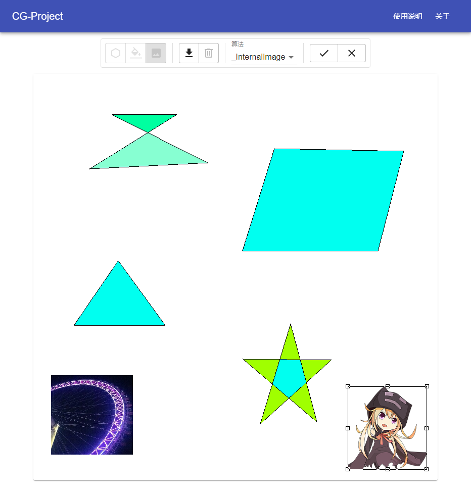
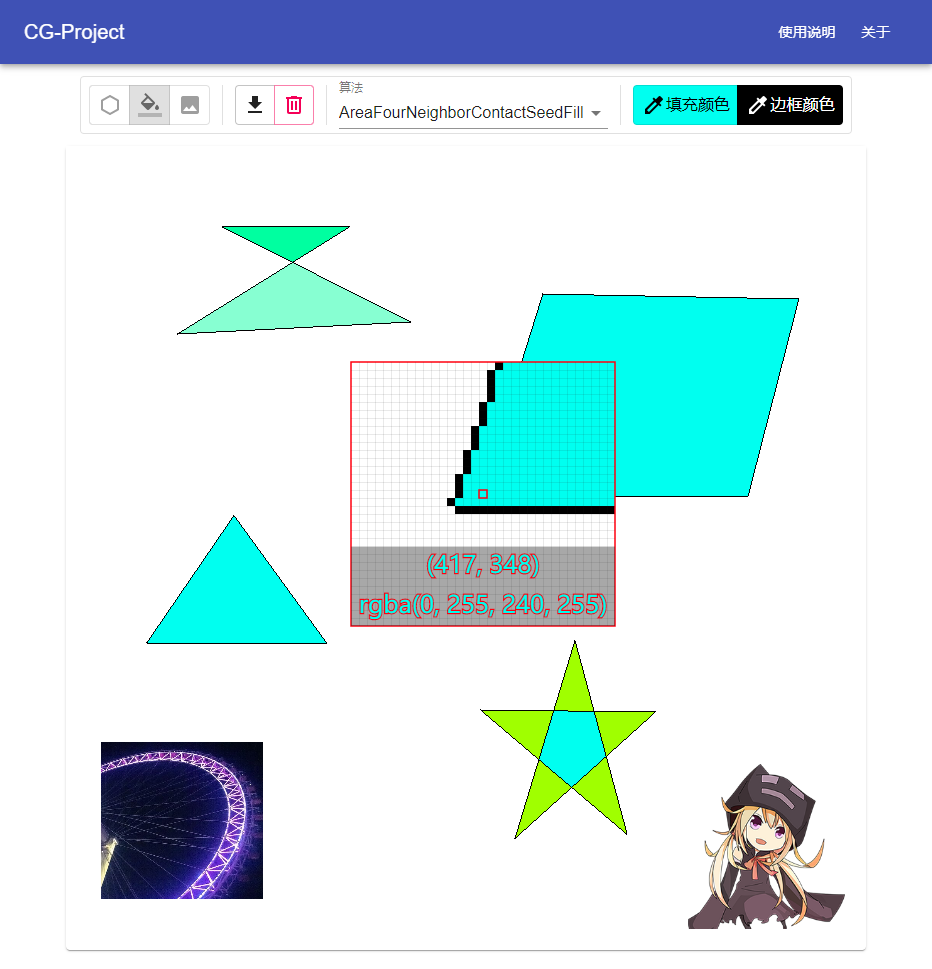

# CG-Project

基于 React 框架开发的计算机图形图像课设

## 特性

### 支持操作

- 多边形绘制
- 矩形绘制
- 填充
- 图片导入、导出

### 支持算法

- DDA
- Bresenham
- 区域四邻接种子填充
- 区域八邻接种子填充
- 扫描线填充

### 额外特色

- 坐标/色彩选取器
- 图片大小自由缩放、拖放

## 截图

## 快速开始

本项目使用 Create-React-App 脚手架构建，使用该脚手架应下载安装 npm，一切就绪后，推荐使用 vscode 进行最终构建。

## 操作提示

详见 [wiki](https://github.com/LonelySteve/cg-project/wiki)

## 许可证

GPL-3.0
